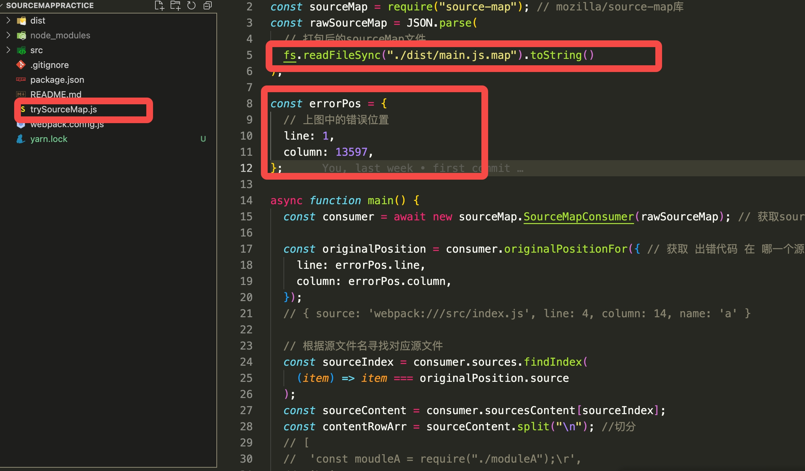

# sourceMapPractice

> 通过 source-map 第三方库 结合压缩后的代码 js 报错的行列信息，定位源码中的错误位置， [source-map](https://github.com/mozilla/source-map#new-sourcemapconsumerrawsourcemap) for bundling

# 如何使用

## 第一步：clone 当前包到本地

```bash
git clone https://github.com/wscfe/sourceMapPractice.git
yarn install
```

## 第二步：准备 SourceMap 文件，报错信息

- 准备 SourceMap 文件，反解出压缩前文件报错代码位置
- 报错信息：报错行，报错列

## 第三步：更新【trySourceMap.js】文件

<p align="center">
  
</p>

## 第四步：执行【trySourceMap.js】脚本

```bash
node trySourceMap.js
```
